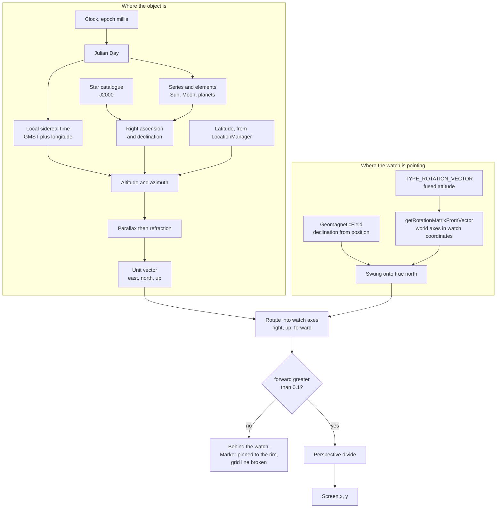
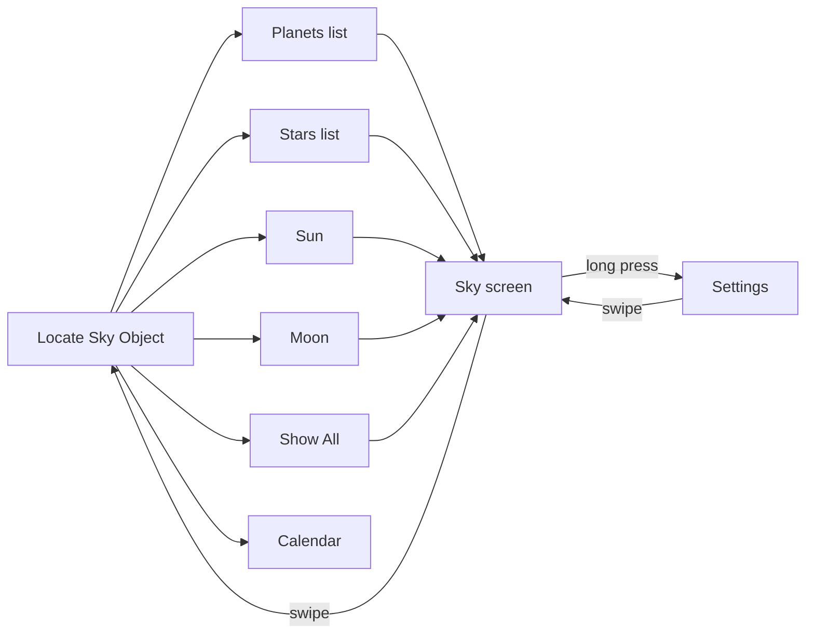
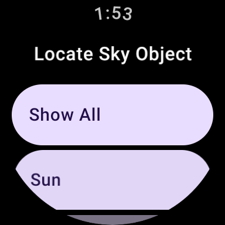
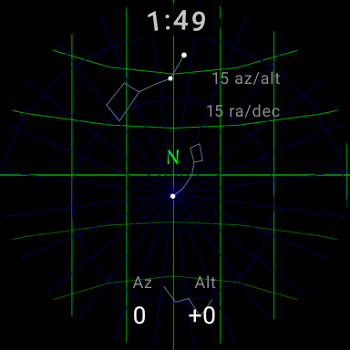
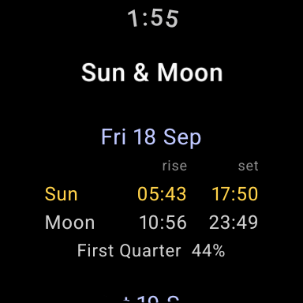
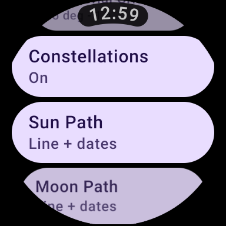
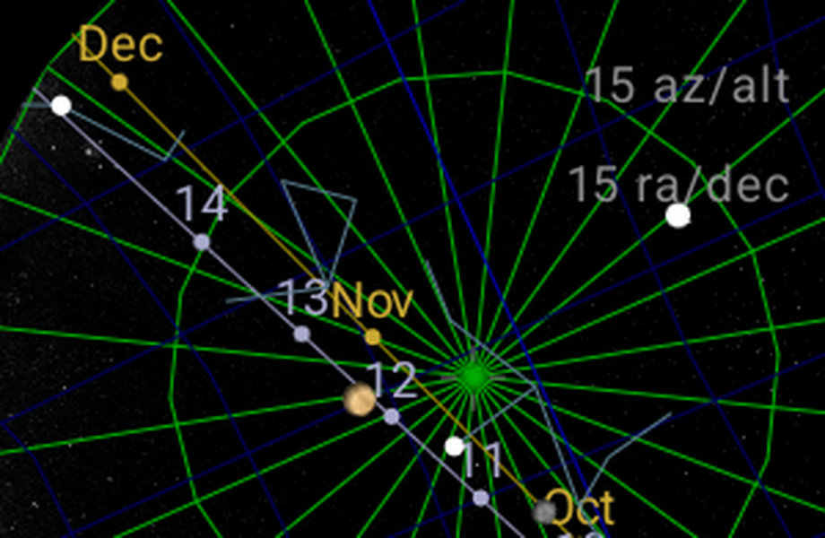
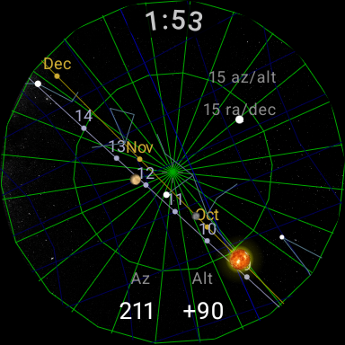
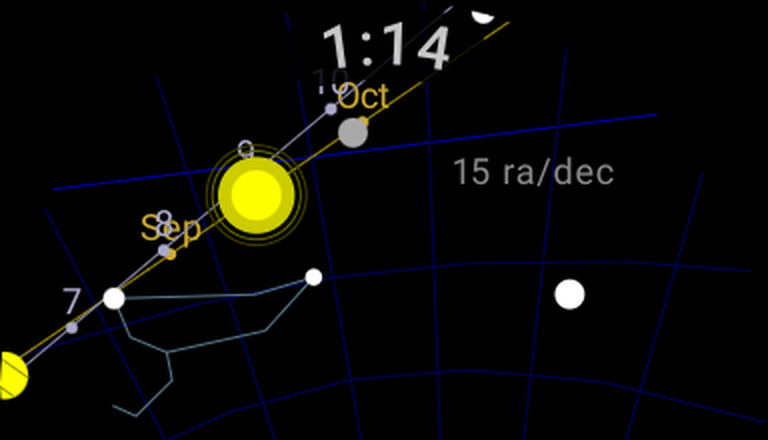

# Megaverse

A sky pointer for Wear OS watches. Pick an object (the Sun, the Moon, a planet, a
bright star), hold the watch up with the back facing the sky, and the object is
drawn where it really is behind the case. Move your arm until the marker settles in
the middle of the screen and you are looking straight at it.

It is the idea behind a phone astronomy app held up with its camera, on a wrist,
with no network, no phone, and no chart to orient yourself against first.

A port of [Miniverse](https://github.com/Cvar1984/Miniverse) to Wear OS.

## Contents

- [How it works](#how-it-works)
- [Screens](#screens)
- [Settings](#settings)
- [The maths](#the-maths)
  - [1. Time](#1-time)
  - [2. Where the object is](#2-where-the-object-is)
  - [3. Turning that into a direction in the sky](#3-turning-that-into-a-direction-in-the-sky)
  - [4. Corrections](#4-corrections)
  - [5. Where the watch is pointing](#5-where-the-watch-is-pointing)
  - [6. Putting the sky on the screen](#6-putting-the-sky-on-the-screen)
  - [7. The sky overlays](#7-the-sky-overlays)
  - [8. Turn-and-tilt guidance](#8-turn-and-tilt-guidance)
  - [9. Drawing the objects](#9-drawing-the-objects)
  - [10. Rise and set](#10-rise-and-set)
- [Source map](#source-map)
- [Cost and frame time](#cost-and-frame-time)
- [Testing](#testing)
- [Building](#building)
- [Devices](#devices)
- [Accuracy](#accuracy)
- [Licence](#licence)

## How it works

The aim axis is the watch's Z axis, straight out through the back of the case, not
the 12 o'clock edge. That makes the watch a viewfinder: you look at the screen, the
sky is behind it, and the object is drawn at the place on the glass you would see it
through if the watch were transparent.

Because it is a window, turning your wrist turns what you see through it. The
picture is built in the watch's own frame and rolls with your hand. The written
turn/tilt guidance underneath is measured against gravity instead, because it
describes how to swing your arm, which has nothing to do with how the watch is
rotated in your grip.

Two independent chains meet at the projection:



## Screens





### Aiming at one object

The object name at the top, the marker where the object is, and a table below:
azimuth and altitude for the object (`Obj`) and for the aim (`Aim`), then how far
to `Turn` and `Tilt`. The two rows converge as you settle onto the object. If a
sensor axis is wired the wrong way they move apart as you close in, so the fault
shows at once.

Within $8^\circ$ of the object the marker takes a green ring and the guidance is
replaced by `On target`.

When the object is off the edge of the view it pins to the rim with a chevron
pointing further the way to move, inset far enough that the marker and its chevron
both stay on the glass.

### Show All



This mode draws the whole catalogue as a plain sky map: the Sun, the Moon, the
planets and the bright stars. Nothing is being aimed at, so there is no turn/tilt
guidance, only a readout of where the watch is pointing.

Nothing is pinned to the rim in this mode, because with the whole sky on show the
markers would pile up around the edge. An object that is not in front of the watch
is not drawn.

A small gapped reticle marks where the watch points - four ticks with a hole in the
middle, because a solid cross would sit on top of the object exactly as you close on
it. Whatever the reticle is within five degrees of gets named, ringed, and given the
one extra fact worth the room: a magnitude for a star, a phase for the Moon.

### The calendar



A fortnight of days, each with when the Sun and the Moon cross the horizon and what
phase the Moon is at. Column heads on every row rather than once at the top: the
list scrolls, so the top of it is usually off screen, and two bare times side by
side give no way of telling which is which.

A body that never sets says `up all day` across both columns rather than filling
them with dashes, which would read as missing data instead of as the Sun not
setting.

## Settings

Hold anywhere on a sky screen. Every setting changes what is on the screen behind,
so they are reachable from the screen they affect rather than only from the root
menu. Selecting an item steps it to its next value in place. A short list is quicker
to thumb through than a submenu, and the label cannot go stale behind the menu
showing it.

A watch has no menu button, so the hold lands on the sky itself. It is detected
without consuming the gesture, because on Wear OS the sideways drag is the only way
back and a full-screen clickable would swallow it.



| Setting | Values | Default |
|---|---|---|
| Horizon Grid | Off · 60 · 45 · 30 · 15 · 10 degrees | Off |
| Equatorial Grid | Off · 60 · 45 · 30 · 15 · 10 degrees | Off |
| Constellations | Off · On | Off |
| Milky Way | Off · On | Off |
| Sun Path | Off · Line · Line + dates | Off |
| Moon Path | Off · Line · Line + dates | Off |
| Equatorial Motion | Held still · Turns with sky | Held still |
| Azimuth Motion | Held still · Follows position | Held still |
| Update Location | One fix only · every 5 / 15 / 30 / 60 min | One fix only |

The Milky Way is drawn per pixel on the GPU, which needs a shader the system
software only provides from Wear OS 4. Below that the setting says so rather than
sitting there doing nothing.

Spacings that come to a whole number of hours say so. The sky turns $360^\circ$ in
24 hours, so $15^\circ$ is one hour of it and the grid divides the sky into
hour-wide cells.

Everything starts off and held still. The grids are there when you ask for them,
and a grid that stays put is easier to read against than one that drifts.

Azimuth Motion has nothing but position updates to follow, since the horizon frame
has no clock in it. With location updates off it says `On - no updates` rather than
claiming to follow something that never arrives.

The display is held awake while a sky screen is up.

---

# The maths

Everything below runs on the watch from the clock, one sensor and a position, with
no almanac file and no network connection.

## 1. Time

The clock arrives as Unix milliseconds, and JD 2440587.5 is 1970-01-01T00:00:00Z,
so the whole conversion is one offset and one division:

```math
JD = \frac{\mathit{millis}}{86400000} + 2440587.5
```

Unix time ignores leap seconds where UTC counts them, which puts this under a
second out: four thousandths of a degree of sky rotation, far below anything a
wrist compass can resolve.

Going the other way, back onto a wall clock for the calendar, the result is
**rounded rather than truncated**. A Julian Day this century is about 2.46 million,
which leaves a `Double` barely enough mantissa for millisecond resolution, so the
trip out and back lands a fraction of a millisecond short — and truncation turns
that fraction into a whole millisecond.

Greenwich Mean Sidereal Time is the usual series, and local sidereal time is that
plus the observer's east-positive longitude:

```math
\mathit{GMST} = 280.46061837 + 360.98564736629\,d + 0.000387933\,T^2 - \frac{T^3}{38710000}
```

The day count is multiplied by 361 before being wrapped back into a circle, so it
passes through three and a half million degrees on the way. Kotlin's `Double` is
64-bit, so that precision comes free rather than having to be forced.

## 2. Where the object is

**Stars** are a table of J2000 right ascension, declination and visual magnitude,
ordered by brightness. Precession and proper motion are ignored: both are far under
what a wrist compass resolves.

**The Sun** is Meeus' abbreviated series — geometric mean longitude, mean anomaly,
the equation of the centre, then nutation and aberration folded into the apparent
longitude.

**The Moon** is Meeus' abbreviated lunar series: thirteen terms in longitude and ten
in latitude, from the elongation, the two mean anomalies and the argument of
latitude.

**The planets** are Keplerian elements with Kepler's equation solved by
Newton-Raphson, heliocentric coordinates rotated by the node and inclination, then
shifted by the Earth-Sun vector to become geocentric.

All four end at ecliptic longitude and latitude, and the same rotation by the
obliquity takes them to right ascension and declination.

## 3. Turning that into a direction in the sky

Hour angle is $H = \mathit{LST} - \alpha$, and the altitude and azimuth follow:

```math
\sin a = \sin\delta\sin\varphi + \cos\delta\cos\varphi\cos H
```

The sum is clamped to $[-1, 1]$ before the arcsine. An object passing close to
overhead makes it come to a shade over 1 in floating point, and `asin` outside its
domain is not a number, which then poisons the altitude, the azimuth and everything
drawn from either.

Altitude and azimuth become an East-North-Up unit vector, and for the grids and the
paths — which are thousands of fixed points — the whole rotation is written out once
as a matrix and applied per frame at nine multiplications a point.

## 4. Corrections

**Parallax** pushes an object down, by more the closer it is. It goes as the cosine
of the altitude, so it is zero at the zenith and full at the horizon. Only the Moon
is close enough to matter, at about $0.95^\circ$; the Sun comes to $0.0024^\circ$
and the stars to nothing.

**Refraction** lifts it back up, by more the lower it is — Bennett's formula, about
$0.57^\circ$ at the horizon and $0.09^\circ$ ten degrees up.

Both act along the vertical circle, so the azimuth is untouched.

## 5. Where the watch is pointing

Android supplies the pointing frame whole, so none of it is assembled here.

`TYPE_ROTATION_VECTOR` is the fused, gyro-stabilised attitude, and
`SensorManager.getRotationMatrixFromVector` turns it into a matrix whose rows are
the world axes (east, north, up) and whose columns are the device axes — which is
the frame the projection wants. Being gyro-fused it needs no smoothing of its own,
so there is no filter over it.

That leaves one thing to do: the matrix is referenced to **magnetic** north, and
every object on this screen comes from right ascension and sidereal time, which are
true by construction. A magnetic frame would turn the whole drawn sky by the local
declination — a few degrees in most places, twenty in parts of Canada, against an
eight degree lock.

`GeomagneticField(lat, lon, altitude, time).declination` gives that outright from
the position, east-positive, which is the convention the rotation wants — a model
lookup rather than anything inferred from a system heading:

```math
\hat{n}_{true} = \hat{n}\cos D - \hat{e}\sin D
\qquad
\hat{e}_{true} = \hat{e}\cos D + \hat{n}\sin D
```

Up is the rotation axis, so it comes through untouched.

The aim itself is the device's $-Z$ axis carried into the world, which is the third
column of the matrix negated. Android's Z points out through the glass, so the back
of the case — the face you aim at the sky — is the other way. That sign applies to
**forward alone**: flipping the sideways and forward components together cancels in
the sideways divide and can only invert up and down, while inverting forward turns
both screen axes over at once, which shows up as the object following the watch
instead of sliding against it.

## 6. Putting the sky on the screen

A sky direction is rotated into the watch's own axes as `[right, up, forward]`, all
three direction cosines. Forward at or below zero means it is behind you.

```math
x = c_x + f\frac{\mathit{right}}{\mathit{forward}}
\qquad
y = c_y - f\frac{\mathit{up}}{\mathit{forward}}
```

The divide puts the object where a camera would, not merely in the right general
direction. $f$ is the pixels-per-radian scale: at a half-field of $45^\circ$ it
comes out as exactly half the screen width, so an object $45^\circ$ off the aim
lands precisely on the rim.

Screen $y$ runs down where the sky runs up, which is the one place that sign has to
be turned over and the easiest to leave out.

No box is carved out of the display for the text. The name and the readouts are
drawn onto the sky, so the picture runs to all four edges instead of sitting in a
letterbox. On a round display the text blocks are sized to the chord the glass
offers on their narrowest row, because the columns have to line up all the way down
and a circle narrows towards both ends.

## 7. The sky overlays

**The grids.** The horizon grid is circles of equal altitude and the vertical
circles between zenith and nadir, in greens. The equatorial grid is circles of equal
declination and the hour circles between the poles, in blues, kept dimmer — the
horizon frame is the one you steer by and this sits behind it. Each is one hue in
three brightnesses, so a grid reads as one thing with a near side and a far side.

Neither depends on the clock, on where you stand, or on how the watch is held, so
the points are worked out once per spacing and kept. Only the rotation into the
watch's axes is redone per frame.

Sidereal time is the only thing in the equatorial grid that moves, so pinning it to
one reading holds that grid still. A new position drops the pin, since it makes the
old reading wrong.

**Constellations.** Stick figures for all twelve of the zodiac, which is what the
ecliptic runs through, plus the bright ones off it that most people can already
find.

The vertices live with the figures rather than in the catalogue because most of them
are not stars you would ever aim at. A figure needs its faint stars to read: Orion
without Mintaka and Saiph is three dots, and the Plough without Dubhe and Merak is
unrecognisable.

Refraction *is* applied here, unlike in the grids. A grid line is its own reference
and nothing has to agree with it, but these lines have to sit under the stars they
join, and those stars are lifted. Without it Orion's belt draws a couple of pixels
below its own three stars as the constellation rises.

**The Milky Way** is the one thing here that is not drawn as lines, and the one
thing that is a shader. Every other overlay projects a handful of points forward
onto the glass; this has to go the other way - for each of 147,000 pixels, which way
is that looking - and that inverse is hopeless on a watch CPU and nothing on a GPU.

It is a photograph rather than anything computed. The band's structure is what makes
it recognisable, and a smooth function with noise on it produces something that
reads as dust. The plate is sampled in galactic coordinates, which is the frame it
does not move in, so the whole thing is one matrix folded on the CPU and three dot
products a pixel.

The plate's empty sky is not black - it sits around 0.03 - and its band runs from
about 0.19 out in Cygnus to 0.53 over the bulge. Scaling that down would wash the
watch face grey and a power curve would crush the fainter half away, so the floor is
lifted off and the top of the band taken as white.

**Sun and Moon paths.** Both are great circles, so both are built the same way —
from the pole they turn about. That is the whole of the difference between them:
where the pole sits. The ecliptic's is a quarter turn from the equinox and one
obliquity short of the celestial pole; the Moon's is a quarter turn behind its
ascending node and one inclination ($5.145^\circ$) short of the ecliptic pole.



The lunar node slides all the way round the ecliptic every 18.6 years — some
nineteen degrees a year — so a path pinned to one epoch is visibly wrong within
months. It is rebuilt once a day. The tilt itself does not move.

Switched to `Line + dates`, each line carries a calendar: month names along the
ecliptic at the Sun's position on the first of each month, and day numbers along the
lunar path at the Moon's position at midnight, for one full circuit of it. A
circuit, rather than some convenient number of days, because the line is drawn whole
and anything less leaves long stretches of it carrying no date at all.



## 8. Turn-and-tilt guidance

Measured against gravity rather than the watch's own axes, so rolling the wrist
leaves it alone: it says how to swing your arm, which does not depend on how the
watch is turned in your hand.

"Right" of the aim is horizontal and perpendicular to it; "up" is perpendicular to
both, so tilting along it climbs straight toward the zenith rather than sideways.
Tilt is measured off the aim's own horizontal plane, not straight off the aim axis —
both amount to the same thing near the object, but this stays well defined when it
is far to one side, where "aim" and "up" both fall to zero and dividing one by the
other is meaningless.

Aimed within a couple of degrees of straight up or down there is no sensible "turn
left" to give, since every direction is sideways from there. The picture still
holds, so only these two lines drop out and the screen says `Straight up/down`.

## 9. Drawing the objects



None of the discs is a true angular size — the real Sun is half a degree across, not
seven — so they are symbols, and one constant says how loud. Their sizes relative to
each other are the meaningful part: the Sun largest, then the Moon, then the planets
by the room their features need, then the stars scaled by magnitude.

**The Moon's phase** comes from the angle between the Moon and the Sun as seen from
here. Both are unit vectors, so their dot product is the cosine of the elongation
and the lit fraction follows directly: $k = (1 - \hat{m}\cdot\hat{s})/2$. What the
drawing wants is $c = 2k - 1 = -(\hat{m}\cdot\hat{s})$, which runs from $-1$ at new
through $0$ at half to $+1$ at full, and is the width of the terminator ellipse as a
fraction of the disc.

The bright limb faces the Sun, so the whole thing is oriented by the tangent
direction from the Moon towards it. That comes out of the geometry rather than off
the screen, which is why it stays right as the wrist rolls. The unlit side is drawn
faint rather than left out: on a black panel a thin crescent would otherwise be all
there is of the Moon, and easy to lose against the stars.

Two convex half-ellipses rather than one lune, because a crescent is concave.

**Saturn's rings and Jupiter's belts** lie along the object's own equator, taken as
square to the local vertical and worked out from where the zenith falls in the watch
axes — so they roll with the sky rather than with the wrist. A ring pinned to the
screen would be wrong as soon as you turned your arm.

## 10. Rise and set

The calendar walks the day at ten-minute steps and watches the altitude change sign,
rather than using the usual closed-form hour angle. That formula treats the body as
fixed for the whole day, which is fine for a star and wrong for the Moon: it moves
thirteen degrees between one moonrise and the next, enough to shift the time by the
best part of an hour. Walking the day costs more arithmetic and asks nothing about
how fast the body moves, so the same code answers for both.

The crossing is found by straight-line interpolation inside the bracketing pair.
Altitude moves at about a quarter of a degree a minute near the horizon and is very
nearly straight over ten of them, so this lands inside a minute.

The threshold is $-0.2666^\circ$, not zero: the Sun and Moon are discs about half a
degree across, so they are already showing while their centre is still below the
skyline. Refraction is already in the altitude by then.

A body that never crosses is told apart by where its altitude sat, not by the
absence of a crossing — the midnight Sun and the polar night are the same code path
with no crossing found.

## Source map

| File | What it does |
|---|---|
| `sky/SkyMath.kt` | Time, coordinate conversion, refraction, parallax |
| `sky/Ephemeris.kt` | Sun and Moon series, obliquity, phase; Keplerian planets |
| `sky/SkyCatalog.kt` | The object registry, the bright-star table, RA/Dec dispatch |
| `sky/DeviceAim.kt` | Declination swing, projection, the aim frame, guidance |
| `sky/Grids.kt` | Alt/az and RA/Dec grid meshes |
| `sky/Constellations.kt` | Stick figures, drawn from their own vertices |
| `sky/SkyPaths.kt` | Ecliptic and lunar path, and their date marks |
| `sky/RiseSet.kt` | Horizon crossings by sampling the day |
| `presentation/SkyScreen.kt` | The sky screen: both modes, overlays, chrome |
| `presentation/SkyDraw.kt` | Colour, size and face of each body; Moon phase |
| `presentation/SkyState.kt` | Sensors, position, and the catalogue snapshot |
| `presentation/CalendarScreen.kt` | The Sun and Moon calendar |
| `presentation/Settings.kt` | Persisted choices, cached in Compose state |
| `presentation/MainActivity.kt` | Entry point, navigation, menus |
| `src/test/` | Unit tests |

## Cost and frame time

The sky is redrawn on every sensor sample, and what dominates the frame is grid
density and catalogue size.

- **Grids** keep fixed points, built once per spacing and kept; each frame only
  rotates them. The point count grows as the spacing shrinks.
- **The catalogue** is worked out every few seconds and held, since the sky moves
  well under a pixel in that time. Only the projection is redone per frame, and the
  cache is dropped when your position changes.
- **The paths and their dates** move slower still: the ecliptic never moves, and the
  lunar node and the date marks are rebuilt once a day.
- **Position** is event-driven. A cached fix is used immediately; a fresh one is
  requested alongside, and retried if the first attempt comes back with nothing —
  "one fix only" means stop once there is one, not give up if the first misses.
- **The readouts** sit behind `derivedStateOf`, so the text recomposes only when a
  digit it displays actually changes rather than on every sample that redraws the
  sky.

## Testing

JVM unit tests over the sky maths, the catalogue and the settings ring. The Compose
screens and the canvas drawing are excluded from coverage — a unit test cannot
exercise them, and counting them would only dilute the number that says whether the
maths is tested.

```sh
./gradlew :app:testDebugUnitTest
./gradlew :app:coverage        # HTML report under app/build/reports/jacoco
```

The tests are invariants wherever one exists, because an invariant keeps testing
after someone changes a constant where a hand-copied decimal only tests that it was
copied correctly. The Sun cannot leave the tropics; the planets cannot leave the
zodiac; a zenith is a zenith at every latitude; Kepler's equation has to survive
being put back; the marker and the written guidance must point the same way when the
wrist is square, and must diverge when it is rolled.

Every test fixture orientation is asserted to be a real rotation — determinant $+1$
— because a reflection preserves length and dot products, so it passes almost every
test written against it and fails only on which way round the world is.

## Building

Android Studio, or:

```sh
./gradlew :app:assembleDebug
```

The Gradle toolchain is pinned to JDK 25 and will provision it if you have not got
it. Needs an Android SDK with API 37. Permissions: `ACCESS_FINE_LOCATION` and
`ACCESS_COARSE_LOCATION`.

To run it on an emulator you need a Wear OS system image and hardware
virtualisation enabled in your BIOS — without KVM the Android watchdog kills
`system_server` before boot finishes.

```sh
sdkmanager "system-images;android-34;android-wear;x86_64"
avdmanager create avd -n wear -k "system-images;android-34;android-wear;x86_64" -d wearos_small_round
```

Set a position with `adb emu geo fix <longitude> <latitude>`, and point the watch
with `adb emu sensor set acceleration 0:0:-9.81` — that puts the back of the case
toward the zenith, which is the only way to see the sky screen do anything on a
device that is lying still on a desk.

## Devices

Wear OS 3 and later (API 30+), round or square. Layout is derived from the display
size rather than fixed pixel offsets, and on round displays the text blocks are
pulled in to where the glass reaches on their narrowest row.

A watch without a rotation vector — no compass, or no sensor fusion over it — shows
`No compass on this watch` rather than waiting for a reading that never comes.

## Accuracy

Accuracy is limited by the magnetometer. A wrist compass resolves a few degrees at
best, and every approximation here is chosen to sit comfortably underneath that:

| Source | Error |
|---|---|
| Sun position | $< 0.01^\circ$ |
| Moon position | $\approx 0.02^\circ$ |
| Planets | arcminutes |
| Stars (no proper motion or precession) | arcminutes |
| Refraction (Bennett) | $< 0.02^\circ$ above $5^\circ$ altitude |
| Moon against its own mean path | $< 0.35^\circ$ |
| Rise and set times | $< 1$ minute |
| Earth's flattening, ignored | $\approx 12''$ |
| Leap seconds, ignored | $< 1$ second |
| **Wrist magnetometer** | **a few degrees** |

## Licence

GPL-3.0. See [LICENSE](LICENSE).

A port of [Miniverse](https://github.com/Cvar1984/Miniverse) by Cvar1984, which is
where the approach and most of the astronomy come from. Three parts of that approach
follow [Stellarium](https://github.com/Stellarium/stellarium): working in vectors
rather than angles, de-rotating the raw field instead of trusting a system heading,
and taking the lunar phase from the elongation. No Stellarium code or assets are
used. Solar and lunar series are from Jean Meeus, *Astronomical Algorithms*; the
planetary elements follow Paul Schlyter's *How to compute planetary positions*. The
zodiac line figures follow those published with
[d3-celestial](https://github.com/ofrohn/d3-celestial) (BSD 3-Clause).

The Milky Way plate is the [ESO/S. Brunier all-sky
panorama](https://www.eso.org/public/images/eso0932a/), used under
[CC BY 4.0](https://creativecommons.org/licenses/by/4.0/) and downsampled to
2048x1024. Credit: **ESO/S. Brunier**. Stellarium takes the same approach with Axel
Mellinger's panorama, which is not what is used here - that one is in Stellarium by
the author's own permission rather than under a licence this could rely on.
